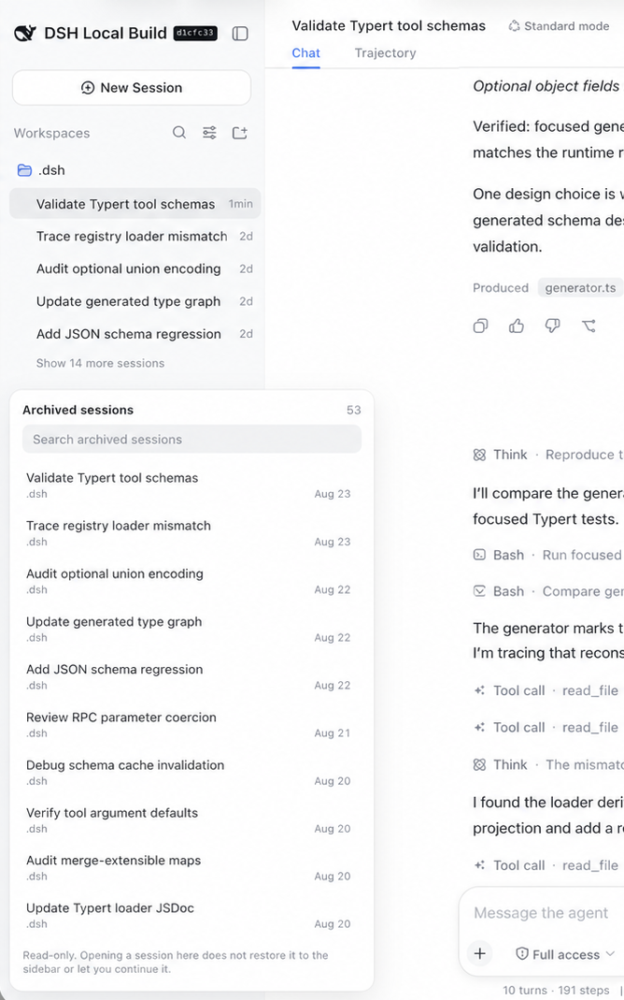
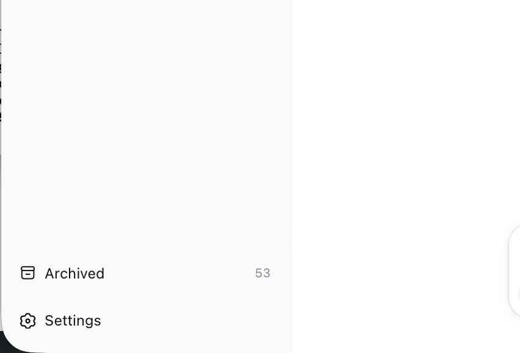
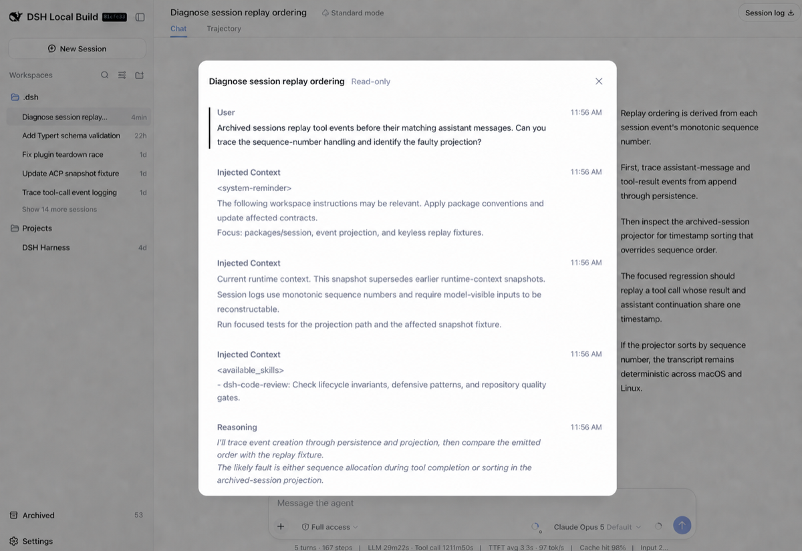

# dsh-plugin-archived-sessions

Browse and read archived [DeepSeek Harness](https://github.com/deepseek-ai/deepseek-harness) sessions from a sidebar panel.

Archiving a session in DSH hides it from every grouping surface — the workspace tree, the flat list, and search. The session log is kept, but the UI ships no way back: there is no unarchive action, no "show archived" toggle, and no way to reach an archived session once it disappears. This plugin gives those sessions a drawer, and a reader.

> **This is a viewer, not an unarchive button.** Clicking a session opens a read-only transcript inside the panel — it does not restore the session to the sidebar, and it does not reopen it in the main chat view so you can keep talking to it. Both of those need harness changes a plugin cannot make; [the reasons are exact and worth reading](#what-it-deliberately-does-not-do) if you were hoping otherwise.



## What it does

Adds an **Archived** entry beside Settings at the foot of the sidebar, with a live count of how many sessions are hidden there:



Opening it shows every archived session, newest activity first, with:

- title and workspace for each row, plus a search box to filter them
- click a row to read that session's transcript in a read-only reader
- backwards pagination through the whole log
- a live count on the trigger
- English and Chinese copy, following the app's active language
- theme-aware styling via the shell's own design tokens

Clicking a row opens that session's transcript in a read-only reader:



The reader shows human prompts, assistant replies, reasoning, injected context (labelled and clamped), and the names of tools that were called. It is plain text: no markdown rendering and no tool cards, because those surfaces live in the shell's conversation packages and reproducing them here would mean vendoring code this plugin does not own.

## What it deliberately does not do

### It does not open archived sessions in the main conversation view

This is the one design decision worth reading before forking, because the obvious implementation looks like it works and does not.

`sessions.open(id)` succeeds on an archived id — `manager.select()` validates only that the id is in the list, and archived sessions stay in the list. But the client runtime sweeps the selection away immediately afterwards, in `WorkspaceRuntime.project()`:

```ts
// packages/client/runtime/src/client/workspaces/service.ts
if (sessions.current !== undefined
    && workspace.archivedSessionIds.includes(sessions.current)) {
  this.sessions.clear()
}
```

`project()` runs on every sessions-store notification, and `select()` ends with `notifier.notifyNow()`. So the sequence is: click → select → notify → sweep → clear, all before React paints. **The click looks completely dead.**

That sweep is deliberate core behaviour — it is how the UI drops a session that another tab just archived, and how a reconnect discards a stale persisted selection. It is not a bug to route around from a plugin, and it fires on every projection rather than only on archive events, so no amount of plugin-side sequencing survives it.

So this plugin does not make archived sessions current at all. It reads the durable log through `session.follow` and `session.page`, then renders the transcript in its own overlay. `tests/smoke.mjs` asserts the plugin never touches the sessions service, so this cannot silently regress.

Making archived sessions genuinely openable is a ~5-line upstream change: make the sweep transition-based (clear when the archive set *changes* to include the current session) instead of state-based. That preserves all three documented sweep cases while letting a deliberate open stick.

### It does not restore sessions to the sidebar

Un-archiving needs a host-side write, and every route into that state is sealed to a plugin:

- `WorkspaceRegistry.archiveSession()` only ever appends — there is no removal method
- its `setState` is private, and the state is written as a whole blob
- `storageDomain.open('workspace')` throws `already-open`, so a plugin cannot open the domain the registry holds
- editing `workspace.json` directly is clobbered, because the registry caches state in memory and rewrites the entire blob on its next mutation

Adding real unarchive means an `unarchiveSession` RPC upstream (registry method, API proxy handler, wire schemas, client manager) — a patch to the harness, not a plugin. Notably the rest of the plumbing already exists: the host frame producer watches `domain/changed` and emits `host/archived-sessions-changed`, and the client manager handles it, so a restored session would appear in the sidebar immediately, in its original position.

Rows whose session has left the session list entirely are shown but disabled: their log may be gone from disk, and the list is the only evidence the client has either way.

## Why it works without touching harness code

- `workspace.list` already ships `archivedSessionIds` to every client as ordinary data
- the session list is never filtered host-side — the store carries every row, and the sidebar's own derivation is what hides archived ones at render time
- `sidebar.footer.action` is a `list` slot that supplies both `useSessions` and `useWorkspaces` as standard props
- `session.follow` and `session.page` read a log from persistence without waking an agent

So the rows are already sitting in your browser; this plugin draws them, and pages the log for the one you pick. It is strictly read-only: it never calls `archiveSession`, never changes the current session, and never writes host state. The node half is deliberately empty.

### A note on page size

Session history pages return every raw event, and `assistant/chunk` dominates a real log by roughly 20:1 — one measured tool-heavy session returned 6,239 events for a 60-message page, 5,917 of them chunks that this viewer folds away. That is 1.7 MB transferred to render 109 lines. The page size is therefore 30 rather than the shell's 60 (0.84 MB for 50 lines). Loopback hides the difference; a Tailscale-reached web UI does not.

## Install

With an installed `dsh` command:

```sh
dsh plugin --profile web add https://github.com/GroupWork888/dsh-plugin-archived-sessions
```

If you run DSH from a source checkout instead, invoke the same CLI through its package script:

```sh
cd /path/to/deepseek-harness
pnpm dsh plugin --profile web add https://github.com/GroupWork888/dsh-plugin-archived-sessions
```

Then restart the Web profile (`dsh web`, or `pnpm dsh web` from a source checkout) and refresh the page. The built bundle is committed, so there is no plugin build step.

From a local clone instead, if you want to read or change the source:

```sh
git clone https://github.com/GroupWork888/dsh-plugin-archived-sessions
cd dsh-plugin-archived-sessions && pnpm install
dsh plugin --profile web add "$PWD"
```

Installing writes only to `$DSH_HOME/profiles/web` (its `package.json`, `node_modules`, and lockfile). Nothing in the harness checkout is modified.

To remove it, run `dsh plugin --profile web remove dsh-plugin-archived-sessions` and restart. Source-checkout users run the equivalent `pnpm dsh plugin ...` command from the harness root.

## Requirements

- A DSH `web` profile. The panel is browser-only.
- Built against the `0.1.2-alpha.1` client packages. The slot contract it uses (`sidebar.footer.action`) is a declared extension seam, but DSH is pre-1.0 and seams may move between releases.

## Develop

```sh
pnpm install      # no harness checkout required
pnpm build        # emits lib/index.js (node half) and lib/client.js (browser half)
pnpm test         # load the BUILT bundle in jsdom and drive the panel
pnpm verify       # build + test — works anywhere
```

**You do not need a `deepseek-harness` checkout to hack on this.** The `link:` dev dependencies point at one, but they are type-only: `pnpm install`, `pnpm build`, and `pnpm test` all succeed with those links dangling, and the resulting `lib/client.js` is byte-identical to one built with the checkout present (verified). The checkout is only ever read, never written.

The one thing that needs it is type resolution:

```sh
pnpm typecheck     # requires ../deepseek-harness (else ~5 cannot-find-module errors)
pnpm verify:types  # build + typecheck + test
```

If you want it, clone the harness as a sibling directory (`../deepseek-harness`) or repoint the `link:` paths in `package.json`. Worth doing before sending a PR — it typechecks against the real DSH contracts and catches wrong prop names and missing locale declarations that a build will happily emit.

`tests/smoke.mjs` executes `lib/client.js` through a fake `__ModuleLoader__` whose `require` answers exactly the shared module table the web shell provides, then renders the registered component and drives a full read. That catches what a typecheck cannot: registering under the wrong id, requesting a module the loader cannot answer, filling the wrong slot, mis-sorting rows, duplicating replies from stream chunks, mislabelling injected context as a human prompt, paging from the wrong cursor — and, above all, reaching for the sessions service, which is the exact bug that made an earlier version's rows unclickable.

The history types are type-only imports from the Remote assembly and Session controller, so the built browser bundle adds no value import that must be present in the shell's shared module table.

## License

MIT
